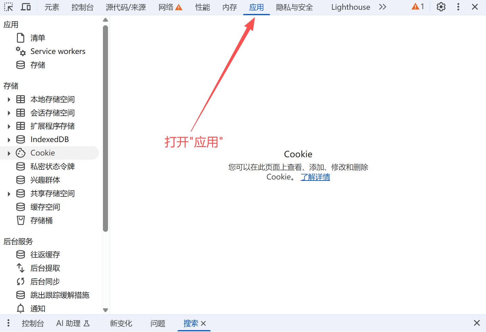
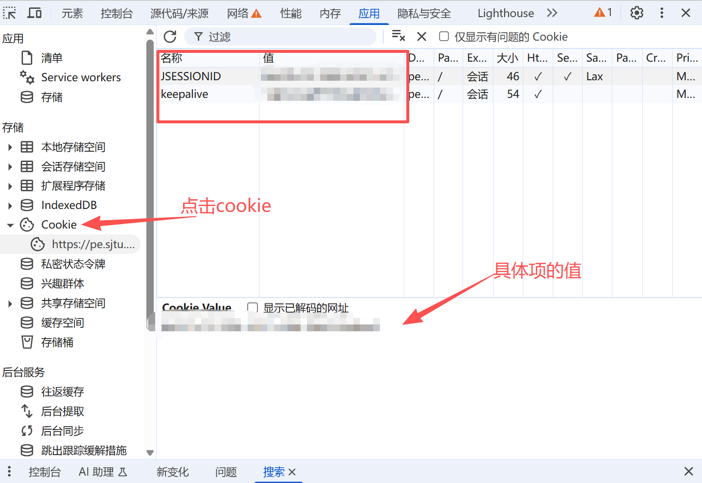

# SJTU 体育跑步上传工具帮助

欢迎使用SJTU体育跑步上传工具！

## 简介
本工具旨在帮助SJTU学生模拟体育跑步数据并上传，以满足学校的体育锻炼要求。请确保您在使用本工具时遵守学校的相关规定。

## 配置说明

### 用户配置
- **Cookie:** 必填项。请通过浏览器或抓包工具获取您在 `pe.sjtu.edu.cn` 网站上的 `keepalive` 和 `JSESSIONID` cookie。格式通常为 `keepalive='...' ; JSESSIONID='...'`。
- **用户ID:** 必填项。您的Jaccount

**配置获取步骤**

**1** 打开链接 [交我跑官网](https://pe.sjtu.edu.cn/phone/#/indexPortrait),如果你的界面类似下面的，则打开成功。

**2** 登陆后，点击 `F12`，然后打开"应用"界面

**3** 点击侧边栏的 "Cookie"，查看 `JSESSIONID` 和 `keepalive`，并写到应用内

### 跑步路线配置
- **起点纬度/经度 & 终点纬度/经度:** 必填项。请填写您希望模拟跑步路线的起点和终点坐标。建议选择学校内部实际存在的坐标，并确保两点之间有足够的距离（例如1-2公里）。

### 跑步参数配置
- **跑步速度 (米/秒):** 必填项。您希望模拟的跑步速度。例如 `2.5` 米/秒大约等于 `9` 公里/小时。
- **轨迹点采样间隔 (秒):** 必填项。生成跑步轨迹点的时间间隔。例如 `3` 秒。

### 跑步时间配置
- **使用当前时间:** 默认勾选。如果勾选，脚本将使用您点击“开始上传”时的系统时间作为跑步开始时间。
- **或手动设置开始时间:** 如果取消勾选“使用当前时间”，您可以手动选择一个过去的日期和时间作为跑步开始时间。这对于补签历史跑步记录可能有用。

## 配置管理
- **加载默认配置:** 载入 `configs/default.json` 中的预设配置（或程序硬编码的默认值）。
- **保存当前配置:** 将当前UI中的设置保存到当前正在使用的配置文件（默认为 `configs/default.json`）。
- **保存配置为...:** 弹出一个文件对话框，允许您将当前UI中的设置保存为新的 `.json` 配置文件到 `configs/` 目录。

## 开始上传
- 点击 **“开始上传”** 按钮启动跑步数据生成和上传流程。
- **进度条** 和 **日志输出** 区域将显示实时状态和任何警告/错误信息。
- 上传完成后，会弹出消息框提示结果。

## 免责声明
本工具仅供学习和研究目的。开发者不对因使用本工具造成的任何后果负责。请谨慎使用，并遵守所有适用的法律法规和学校规章制度。

---
版本: 1.0.0
日期: 2024年7月22日